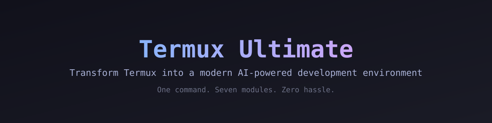

# 🚀 Termux Ultimate



> Transform Termux into a modern AI-powered development environment with a single command.


---

## Features

- 🐚 Oh My Zsh + Powerlevel10k + zsh-autosuggestions + zsh-syntax-highlighting
- 🎨 Catppuccin, Tokyo Night & Dracula themes (`theme catppuccin|tokyonight|dracula|default`)
- 🖥️ tmux with a ready-made config
- ⚙️ Git aliases and sane defaults
- 📈 btop / htop
- 🔍 Dev tools: eza, bat, fd, ripgrep, jq, tldr (with aliases)
- 📊 Fastfetch with a theme-aware config
- 🤖 Ollama (local LLMs)
- 🧠 Gemini CLI
- 🐍 Python Development (pip, IPython, uv)
- 🟢 Node.js Development (npm, pnpm, Yarn)
- 🦀 Rust + Go toolchains
- 🛠️ Native build tools: Clang, CMake, Make, pkg-config
- ⚡ Lazygit — terminal UI for git
- 📲 termux-api (clipboard, wake-lock, open links)
- 🎥 yt-dlp + FFmpeg
- 🩺 `tu doctor` — health checks + update check
- 🛠 `tu repair` — self repair
- 🔄 `tu update` — self update
- 🗑 `tu uninstall` — full or per-module removal
- 💾 `tu backup` / `tu restore` — dotfile backup & restore

---

## Installation

```bash
curl -fsSL https://raw.githubusercontent.com/sachit1751-art/Termux-ultimate/main/install.sh | bash
```

This bootstraps the environment (updates packages, installs git), clones the project to `~/.termux-ultimate`, and asks which modules to install:

```
Which modules should I install? (comma-separated numbers, e.g. 1,3,5)
  0) none
  1) shell
  2) python
  3) node
  4) ai
  5) media
> 1,2,3
```

Type `all` for everything, `none` (or just press Enter) to skip. Everything is logged to `~/.termux-ultimate/logs/install.log`.

**Piped (non-interactive) mode:** when the script is piped there is no terminal to prompt, so pass the modules as arguments instead:

```bash
curl -fsSL https://raw.githubusercontent.com/sachit1751-art/Termux-ultimate/main/install.sh | bash -s shell python ai
```

The installer continues with remaining selected modules if one fails, then exits with status `1` and points to `~/.termux-ultimate/logs/install.log`. A zero exit status means every selected module completed.

Running the installer again updates an existing install in place (no duplicate clone). It also requests storage access via `termux-setup-storage` so downloads and projects can live in shared folders.

## Usage

The installer puts `tu` on your PATH, so just type `tu` anywhere:

```bash
tu              # Interactive menu (no arguments needed)
tu doctor       # Check your setup health
tu doctor --json # Machine-readable health status
tu doctor --quiet # Check health without printing details
tu repair       # Reinstall anything that is missing
tu update       # Pull the latest version
tu update --check # Check for updates without changing files
install.sh --retry-failed # Retry modules that failed previously
tu uninstall        # Remove the setup
tu uninstall shell  # ...or just one module
tu backup           # Back up your dotfiles
tu backup --list    # List saved backups
tu backup --list --json # List backups as JSON
tu restore <file>   # Restore from a backup
tu logs             # View the install log
tu logs --tail 100  # View the last 100 log lines
tu version          # Show the current version
tu version --full   # Show version, branch, commit, and update date
tu version --json   # Print version details as JSON
tu status           # Show installed/missing module status
tu status --json    # Print module status as JSON
tu project init <dir> # Create a minimal Git project scaffold

tu install          # Module picker (interactive)
tu install shell    # Or install a specific module
tu install all      # Install every module
tu install shell,node,python  # Install multiple modules
tu install python   # Python, pip, IPython
tu install node     # Node.js, pnpm, Yarn
tu install ai       # Ollama + Gemini CLI
tu install media    # yt-dlp + FFmpeg
tu install lazygit  # Terminal UI for git
tu install lang     # Rust + Go toolchains
tu install dev      # Clang + CMake + Make + pkg-config

tu update   # Pull the latest version
tu upgrade  # Update + repair in one step
tu self-test # Run the local regression checks
tu install --dry-run all # Preview an install
tu uninstall --dry-run shell # Preview module removal
```

Running `tu` with no arguments opens a friendly menu — pick an action with a number, install multiple modules, and press `0` to exit. Every module is idempotent — safe to run multiple times; already-installed tools are skipped.

Nice extras:

- **Tab completion** — type `tu <TAB>` to complete commands, and `tu install <TAB>` to complete modules.
- **Update check** — `tu doctor` compares your local version against the latest release and tells you when to run `tu update`.
- **`tu doctor` exit code** — exits non-zero when something is missing, so it can be used in scripts.
- **Regression checks** — run `bash tests/test.sh` on a Linux or Termux host. CI runs this together with `bash -n` and ShellCheck.
- **Batch installs** — use `tu install all` or `tu install shell,node,python` for scripted setup.
- **Clear CLI failures** — invalid commands and module names return non-zero status and print the relevant help.
- **Automation output** — `tu doctor --json` reports versions, failure count, and individual check results as JSON.
- **Dry runs** — preview install or module removal before changing the device.
- **Backup inventory** — `tu backup --list` shows available archives without modifying files.
- **Read-only update checks** — `tu update --check` checks the remote version without pulling changes.
- **Module status** — `tu status` gives a quick installed/missing summary.
- **Release details** — `tu version --full` shows the current repository commit and date.
- **Completion** — Zsh completion includes commands, modules, `all`, and the new flags.
- **Quiet checks** — `tu doctor --quiet` keeps scripts silent while preserving its exit status.
- **Flexible logs** — `tu logs --tail 100` shows a chosen number of recent lines.
- **JSON backups** — `tu backup --list --json` returns a script-friendly archive list.
- **Secure updates** — updates verify the expected remote and refuse to overwrite local changes.
- **Resumable installs** — `install.sh --retry-failed` retries only modules that failed previously.
- **Project bootstrap** — `tu project init <dir>` creates a README, `.gitignore`, and Git repository.
- **JSON status** — `tu status --json` and `tu version --json` support automation.
- **Native builds** — `tu install dev` prepares C/C++ and CMake projects in Termux.

---

## Project Status

✅ First stable release (v0.1.0) + maintenance releases (v0.1.1–v0.1.3)

Current Version: **0.1.3**

---

## Roadmap

### v0.1 ✅
- Repository setup
- Bootstrap installer
- Logging
- Package manager

### v0.2 ✅
- Zsh
- Oh My Zsh
- Powerlevel10k

### v0.3 ✅
- AI Tools
- Ollama
- Gemini CLI

### v0.4 ✅
- Fastfetch
- tmux
- Themes

### v0.5 ✅
- Interactive menu and tab completion
- Backup & restore
- Per-module uninstall
- CI with syntax checks
- LF line endings everywhere

### v1.0 🚧
- Stable Release (v0.1.0 shipped — v1.0 is the polished milestone)
- One-command installer ✅
- Self-update ✅
- Self-repair ✅

---

## License

MIT License

---

Made with ❤️ by Sachitt